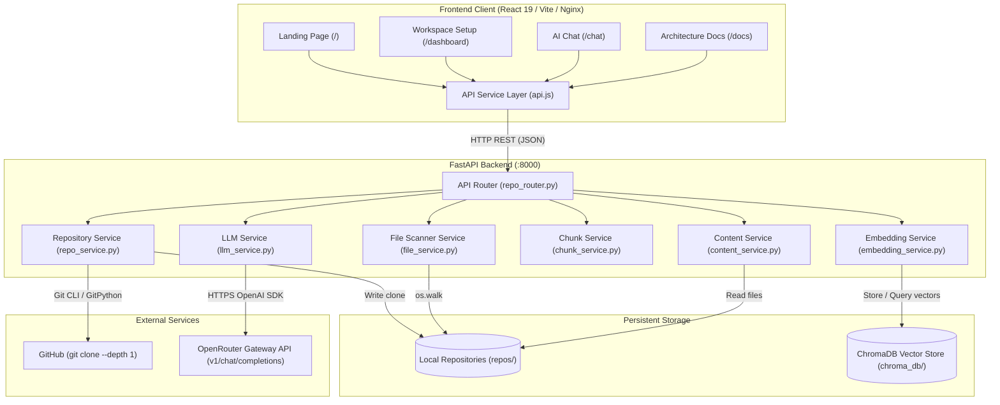
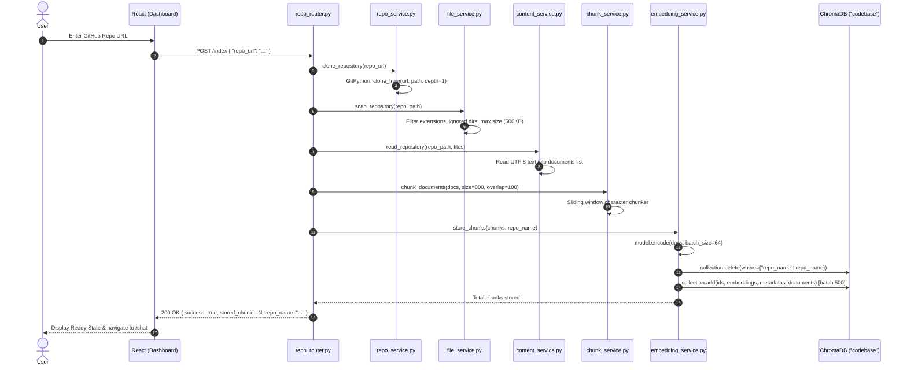
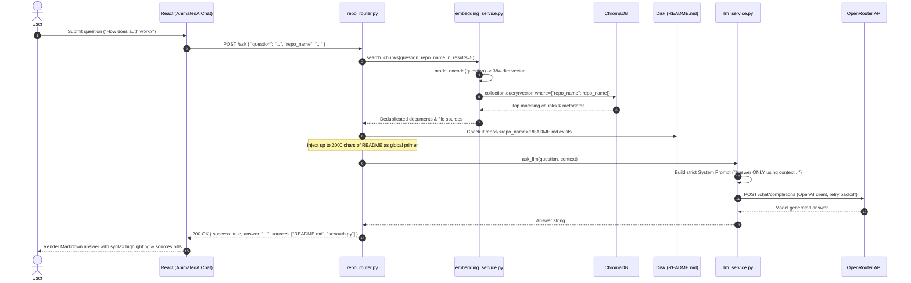
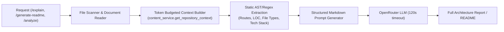

# ContextForge — System Architecture

## Architecture Overview

ContextForge uses a decoupled client-server architecture consisting of:
1. **A Single-Page Application (SPA) Frontend** built with React 19, Vite, TailwindCSS v4, and Framer Motion.
2. **A High-Performance Asynchronous Python Backend** built with FastAPI, orchestrating Git cloning, static analysis, chunking, local sentence transformer embeddings, vector database operations in ChromaDB, and LLM communication via OpenRouter.
3. **A Dual-Layer Storage Tier** using local filesystem directories for cloned repositories and ChromaDB (DuckDB/SQLite + hnswlib vector indices) for semantic embeddings.

---

## 1. System Topology & Data Flow

---

## 2. Ingestion & Indexing Pipeline

When an engineer triggers repository indexing via `POST /index` or `POST /store/{repo_name}`:

---

## 3. Retrieval-Augmented Generation (RAG) & Chat Pipeline

When an engineer queries the codebase via `POST /ask`:

---

## 4. Whole-Repository Analysis Pipeline (Non-RAG Bypass)

Certain tasks (e.g., generating architecture overviews, identifying dead code, auditing security, or synthesizing a `README.md`) cannot rely on 5 localized text chunks because they require a macroscopic understanding of the codebase structure:

- **Context Budget:** Capped at 16,000 characters (~4k tokens) to prevent context explosion.
- **Priority Tiering:** Architectural and configuration files (`README.md`, `package.json`, `requirements.txt`, `main.py`, `Dockerfile`, etc.) are allotted up to 2,500 characters each; remaining source files are allotted up to 1,500 characters until the budget is filled.
- **Precomputed Metadata for `/explain`:** Before calling the LLM, the backend calculates:
  - File count, directory count, language distribution, approximate LOC.
  - Route handlers detected from `@router` / `@app` decorator signatures.
  - Dependencies parsed from `requirements.txt` or `package.json`.
  - Service and schema file listings.

---

## 5. Frontend Architecture

### Routing (`App.jsx`)
Built on React Router v7 with code-split lazy routes:
- `/` -> `Landing.jsx` (Marketing, showcase, interactive demo)
- `/dashboard` -> `Dashboard.jsx` (Workspace setup, repository indexer)
- `/chat` -> `Chat.jsx` (Full-screen chat interface)
- `/docs` -> `Docs.jsx` (Architecture report viewer & Markdown exporter)

### State Management & Persistence
- **Client Storage:** Uses browser `localStorage` for state persistence across sessions:
  - `repo_name`: Active repository identifier.
  - `stored_chunks`: Count of indexed vector chunks.
  - `repositoryIndexed`: Boolean flag for dashboard view switching.
  - `chatHistory`: Full JSON history of chat messages and source citations.
- **Component State:** React `useState`, `useTransition`, `useRef`, and custom hooks (`useReducedMotion`, `useAutoResizeTextarea`).

### Component Hierarchy
- `components/layout/`: `Navbar.jsx`, `AppSidebar.jsx`, `Footer.jsx`
- `components/sections/`: `Hero.jsx`, `Features.jsx`, `ArchitectureFlow.jsx`, `RepoDemo.jsx`, `DeveloperWorkflow.jsx`, `CTA.jsx`, `Testimonials.jsx`, `TrustedBy.jsx`
- `components/ui/`: `AnimatedAiChat.tsx` (primary chat engine), `Button.jsx`, `Card.jsx`, `ContainerScroll.jsx`, `ErrorBoundary.jsx`, `HeroShader.tsx`, `MagneticButton.jsx`, `NeonButton.jsx`, `ScrollReveal.jsx`, `SvgFollowScroll.jsx`
- `components/spline/`: `SplineRobot.jsx` (interactive 3D hero asset)
- `components/graph/`: `DependencyGraphMotif.jsx` (SVG vector background)

---

## 6. Backend API Architecture

All endpoints are hosted in `routers/repo_router.py` mounted directly on the root FastAPI application (`backend/main.py`):

| Endpoint | Method | Input Schema | Purpose | Underlying Services |
| :--- | :--- | :--- | :--- | :--- |
| `/health` | `GET` | None | Service liveness & Chroma doc count | `main.py`, `embedding_service` |
| `/clone` | `POST` | `RepoRequest` (`repo_url`) | Clone Git repository to disk | `repo_service` |
| `/repos` | `GET` | None | List cloned repository names | `os.listdir(REPOS_DIR)` |
| `/scan/{repo_name}` | `GET` | Path parameter | Scan and list included source files | `file_service` |
| `/content/{repo_name}` | `GET` | Path parameter | Read contents of included files | `file_service`, `content_service` |
| `/chunks/{repo_name}` | `GET` | Path parameter | Preview sample generated chunks | `file_service`, `content_service`, `chunk_service` |
| `/embed` | `POST` | `EmbeddingRequest` (`text`) | Test embedding generation | `embedding_service` |
| `/store/{repo_name}` | `POST` | Path parameter | Chunk and persist repo to ChromaDB | `file_service`, `content_service`, `chunk_service`, `embedding_service` |
| `/search` | `POST` | `SearchRequest` (`query`, `repo_name`) | Semantic search in ChromaDB | `embedding_service` |
| `/ask` | `POST` | `AskRequest` (`question`, `repo_name`) | RAG Q&A with source citations | `embedding_service`, `llm_service` |
| `/analyze` | `POST` | `AskRequest` (`question`, `repo_name`) | Macro codebase analysis (deadcode, security) | `content_service`, `llm_service` |
| `/explain` | `POST` | `RepoNameRequest` (`repo_name`) | Generate Architecture Report | `content_service`, `llm_service` |
| `/generate-readme` | `POST` | `RepoNameRequest` (`repo_name`) | Generate README.md file | `content_service`, `llm_service` |
| `/index` | `POST` | `RepoRequest` (`repo_url`) | Single-call Clone + Scan + Chunk + Embed + Store | `repo_service`, `file_service`, `content_service`, `chunk_service`, `embedding_service` |

---

## 7. Deployment & Container Architecture

- **Backend Container:**
  - Multi-stage build based on `python:3.11-slim`.
  - Injects CPU-only PyTorch wheel repository (`https://download.pytorch.org/whl/cpu`) to strip multi-GB CUDA/NVIDIA driver overhead.
  - Warms up and caches `all-MiniLM-L6-v2` inside `/root/.cache` during Docker build for zero-latency, offline startup.
  - Installs system packages: `git` (required by GitPython) and `curl` (used by Docker healthcheck).
- **Frontend Container:**
  - Stage 1: `node:20-alpine` runs `npm ci` and `npm run build` with `VITE_API_URL` build argument.
  - Stage 2: `nginx:alpine` hosts pre-built static bundle at port 80 with Gzip compression and SPA HTML5 fallback (`try_files $uri $uri/ /index.html`).
- **Docker Compose:**
  - Coordinates backend (:8000) and frontend (:3000 -> :80).
  - Configures container restart policies, healthcheck dependencies (`frontend` waits for `backend` healthy check), and persistent named volumes:
    - `chroma_data` -> `/app/chroma_db`
    - `repos_data` -> `/app/repos`
