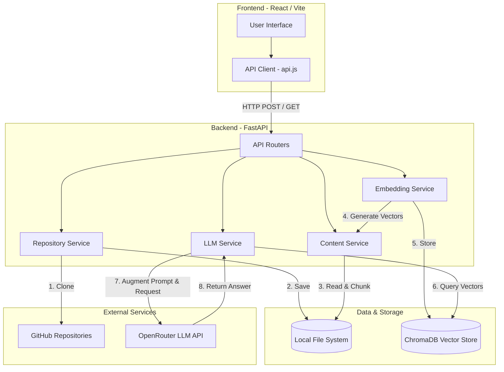

# System Architecture

ContextForge utilizes a decoupled architecture where a React Frontend communicates asynchronously with a Python FastAPI Backend. The backend acts as the orchestrator for local machine operations (cloning, reading), local machine learning operations (vector embeddings), database operations (ChromaDB), and external API calls (OpenRouter).

## Architecture Diagram

## Step-by-Step Explanation

### 1. Frontend to FastAPI
The user interacts with the React interface. When they ask a question or index a repository, the API Client (`frontend/src/services/api.js`) sends an HTTP POST request to the FastAPI backend. FastAPI routes this request to the appropriate controller (e.g., `/api/ask` or `/api/index`).

### 2. Repository Services (Ingestion Phase)
If the request is to index a new repository, the **Repository Service** uses `git` to clone the code from GitHub to a local directory (`backend/repos/`). 

### 3. Chunking (Content Service)
Once cloned, the **Content Service** walks through the directory structure. It ignores irrelevant files (like `.gitignore`, `node_modules`, binaries) and reads the source code. It then splits large files into smaller overlapping text "chunks". Overlapping ensures that context isn't lost at the boundaries of chunks.

### 4. Embeddings
The **Embedding Service** takes these chunks and uses a local machine learning model (`SentenceTransformer('all-MiniLM-L6-v2')`) to convert the text into highly dimensional mathematical vectors. 

### 5. ChromaDB
These vectors, along with metadata (like the repository name, file path, and chunk index) and the raw text, are stored in **ChromaDB**. ContextForge uses a single collection but leverages the metadata (specifically the `repo_name` field) to keep data isolated.

### 6. Semantic Search
When the user asks a question via the UI, the text of the question is passed through the same Embedding Service to generate a "query vector". The backend then queries ChromaDB to find the vectors that are mathematically closest to the query vector, while filtering exclusively for the active `repo_name`. 

### 7. OpenRouter
The backend takes the top matching chunks of code and injects them into a system prompt (e.g., *"Here is the user's question, and here is some relevant code. Answer the question using ONLY the provided code."*). This massive prompt is sent to **OpenRouter**, which routes the request to an LLM.

### 8. Frontend Delivery
OpenRouter streams (or returns) the generated human-readable response to the FastAPI backend, which packages it into a JSON response (along with the source file paths that were used) and sends it back to the React Frontend to be rendered using `ReactMarkdown`.
